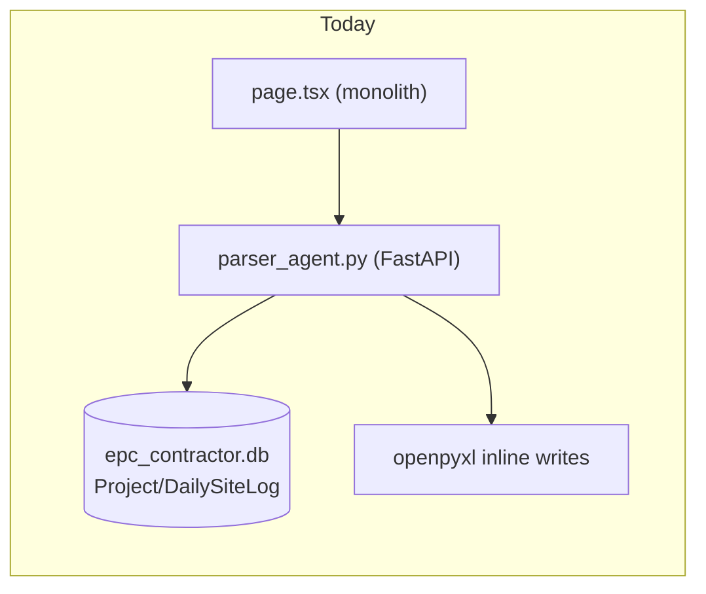
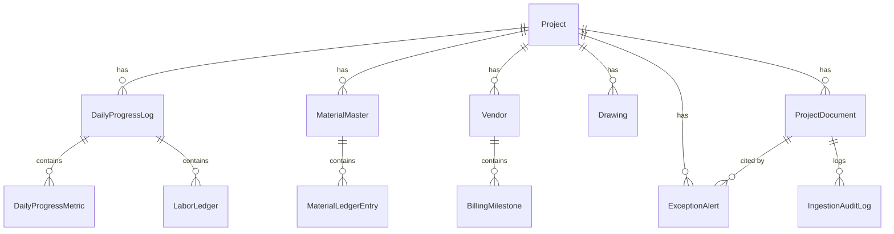
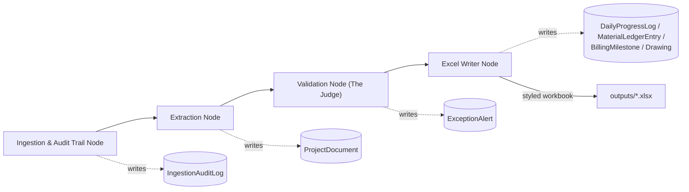
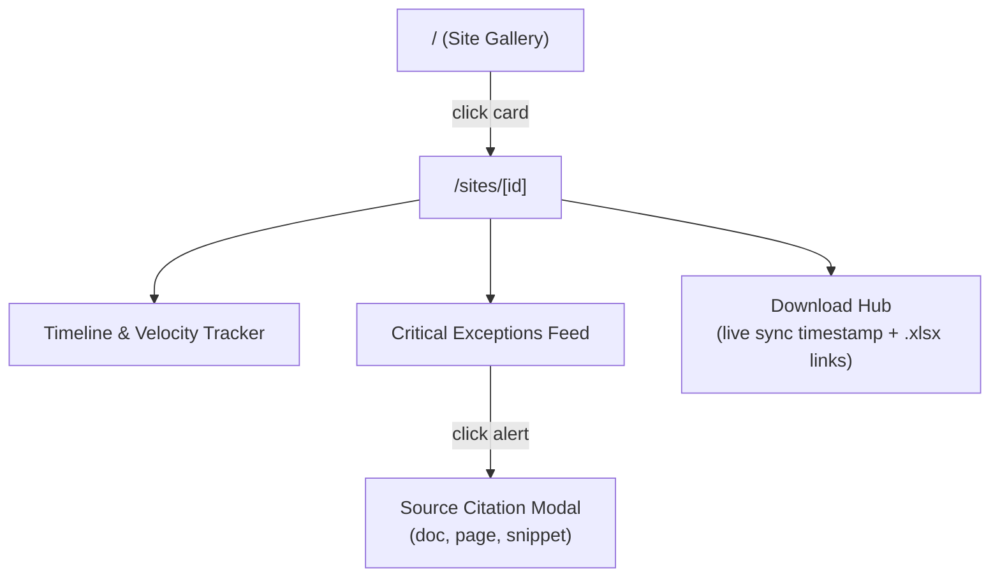

# EPC Multi-Agent Overhaul — Architectural Blueprint

## Decisions locked in with you
- **Site = Project**: no new hierarchy level. The existing `Project` model (`backend/database.py`) is extended in place with site metadata/health fields — it already backs `seed_projects.py`'s 3 demo sites and per-project storage folders.
- **Clean-slate rebuild**: `epc_contractor.db` is dropped and recreated against the new schema; `seed_projects.py` is rewritten to seed richer demo data (sites + sample DPR/material/billing/drawing rows) so the new UI has something to render immediately. Existing uploaded files in `backend/storage/project_1/` are kept on disk (harmless) but their DB rows are regenerated by the new seed script.

## Current-state summary (for context)
- Backend is a single FastAPI app in [backend/parser_agent.py](backend/parser_agent.py) (`uvicorn backend.parser_agent:app`) with inline Gemini vision calls, ad hoc openpyxl writes to `templates/master_site_template.xlsx`, and a separate unused LangGraph prototype in [backend/graph_agent.py](backend/graph_agent.py).
- Schema in [backend/database.py](backend/database.py): `Project → DailySiteLog → {LaborLedger, DailyWorkMetrics}`, plus `ProjectDocument`. No Material, Billing, or Drawing tables. No `requirements.txt` anywhere in the repo.
- Frontend is one 529-line client component ([frontend/app/page.tsx](frontend/app/page.tsx)) with a project dropdown + 2 tabs (analytics grid, GraphRAG chat). No routing, no design system, no charts. [frontend/app/api.ts](frontend/app/api.ts) and [frontend/app/ContractChatbot.js](frontend/app/ContractChatbot.js) are dead code.



---

## 1. Database & Data Schemas (SQLAlchemy)

New file layout: split the monolithic `database.py` into a `backend/models/` package (keeps `database.py` as the engine/session/`Base` bootstrap only, imported by all model modules — avoids one more giant file).

```
backend/
├── database.py                 # engine, SessionLocal, Base, init_db() only
└── models/
    ├── __init__.py              # re-exports all models for `from backend.models import *`
    ├── project.py                # Project (Site) + health enum
    ├── documents.py              # ProjectDocument, IngestionAuditLog
    ├── daily_progress.py         # DailyProgressLog, DailyProgressMetric, LaborLedger
    ├── material_ledger.py        # MaterialMaster, MaterialLedgerEntry
    ├── billing.py                # Vendor, BillingMilestone
    ├── drawings.py                # Drawing (GFC log)
    └── exceptions.py             # ExceptionAlert (the Judge's output, feeds the UI feed)
```

### 1.1 Project (Site) — extended in place

```python
class Project(Base):
    __tablename__ = "projects"
    id = Column(Integer, primary_key=True)
    name = Column(String, nullable=False)
    location = Column(String, nullable=True)
    client_name = Column(String, nullable=True)
    contract_value = Column(Float, nullable=True)
    start_date = Column(String, nullable=True)
    target_end_date = Column(String, nullable=True)
    created_at = Column(DateTime, default=datetime.utcnow)
    # health_status is NOT a stored column — computed live by AnalyticsEngine
    # from open ExceptionAlert severities + schedule variance, so it can never drift.
```

### 1.2 Daily Progress Log (DPR)

- `DailyProgressLog` (one header row per project/date): `id, project_id, report_date, labor_headcount, structural_progress_pct, notes, source_document_id, created_at`.
- `DailyProgressMetric` (replaces `DailyWorkMetrics`, adds a `metric_type` enum so concrete/rebar/shuttering are first-class instead of implicit strings): `id, log_id (FK), metric_type [CONCRETE_VOLUME_M3 | REINFORCEMENT_MT | SHUTTERING_SQM | OTHER], element_id, sub_component, metric_value, unit, formula_notation`.
- `LaborLedger` kept as-is, FK renamed to point at `DailyProgressLog.id`.

### 1.3 Master Material & Inventory Ledger (new)

- `MaterialMaster`: `id, project_id, material_name, unit, design_specified_qty` (BOQ allocation, set once per material).
- `MaterialLedgerEntry`: `id, material_id (FK), project_id, report_date, received_qty, consumed_qty, stock_balance, wastage_qty, wastage_pct, source_document_id, created_at`. `stock_balance`/`wastage_*` are computed at write time by the Excel Writer / Validation node and persisted as a snapshot (so historical ledger rows don't silently change if later corrected).

### 1.4 Vendor Billing & Milestone Tracker (new)

- `Vendor`: `id, project_id, vendor_name, trade, po_number, po_limit`.
- `BillingMilestone`: `id, vendor_id (FK), invoice_number, invoice_date, certified_work_pct, invoice_amount, cumulative_billed, po_remaining_balance, submitted_date, aging_days, status [PENDING|APPROVED|PAID|OVERDUE], source_document_id`.

### 1.5 EPC Regulatory & Drawing Log (new)

- `Drawing`: `id, project_id, drawing_number, drawing_title, discipline, gfc_revision, gfc_issue_date, client_signoff_status [PENDING|APPROVED|REJECTED], client_signoff_date, source_document_id, created_at`.

### 1.6 Cross-cutting: Audit Trail & Exceptions

- `ProjectDocument` (existing) gains: `uploaded_at, file_hash, page_count, mime_type, ingestion_status [PENDING|PROCESSING|COMPLETE|FAILED]`.
- `IngestionAuditLog` (new): `id, project_id, document_id, node_name, status, message, created_at` — one row per LangGraph node execution; this is what "Ingestion & Audit Trail Node" writes.
- `ExceptionAlert` (new) — powers the frontend's Critical Exceptions Feed and its source-citation modal: `id, project_id, category [DPR|MATERIAL|BILLING|DRAWING], severity [INFO|WARNING|CRITICAL], message, related_table, related_record_id, source_document_id (FK), source_page_number, source_text_snippet, is_resolved, created_at`.



---

## 2. Detached Excel Service Layer + LangGraph State Machine

### 2.1 Excel Service Layer (config-driven, no hardcoded cells)

```
backend/excel_service/
├── config.py       # Pydantic: SheetMapping (sheet_name, header_row, data_start_row,
│                   #   field_to_column: dict[str, str], metadata_cells: dict[str, str])
│                   #   WorkbookTemplateConfig (template_path, sheets: dict[str, SheetMapping])
├── templates/
│   ├── demo_dpr_template.json          # today's local demo layout
│   ├── demo_material_template.json
│   ├── demo_billing_template.json
│   └── demo_drawing_template.json      # swap these JSON files (or point to a new
│                                        # directory) to onboard a real client's workbook —
│                                        # zero code changes required
├── styles.py       # reusable openpyxl fills/fonts: OK (green), WARNING (amber), CRITICAL (red)
├── registry.py      # TemplateRegistry: loads the right WorkbookTemplateConfig per
│                    # document category, resolves current template set from an env var
│                    # (EXCEL_TEMPLATE_PROFILE=demo|client_x) so switching business = 1 env change
└── writer.py        # ExcelWriterService:
                      #   .append_row(category, sheet_key, row_data: dict)
                      #   .write_metadata(category, sheet_key, field, value)
                      #   .flag_cell(category, sheet_key, row, field, message, severity)
                      #   .save(output_path) -> also stamps a "Last Synced" timestamp cell
```

This directly replaces the scattered logic in [backend/build_lifecycle_sheets.py](backend/build_lifecycle_sheets.py) and the inline `wb["Daily_Progress_Log"]` / cell-literal writes inside `fanout_ingest` in [backend/parser_agent.py](backend/parser_agent.py) (lines ~280-478). Application/node code never references a sheet name or cell address directly — only logical `(category, field)` keys resolved through `registry.py`.

### 2.2 LangGraph State Machine

```
backend/workflow/
├── state.py     # IngestState (pydantic): project_id, document_ids, category
│                #   [DPR|MATERIAL|BILLING|DRAWING], raw_files, extracted_payload,
│                #   exceptions: list[ExceptionAlertDraft], excel_output_path, audit_log
├── schemas.py    # one structured-output Pydantic schema per category, extending the
│                #   existing pattern in schemas.py / graph_agent.py's AdaptiveLifecycleSchema
│                #   (DPRExtraction, MaterialExtraction, BillingExtraction, DrawingExtraction)
├── nodes/
│   ├── ingestion_node.py    # persists ProjectDocument + file hash/page count,
│   │                        #   writes first IngestionAuditLog row
│   ├── extraction_node.py   # Gemini 2.5 Flash structured output -> category-specific
│   │                        #   schema (reuses the retry/backoff pattern already in
│   │                        #   parser_agent.py's execute_with_retry)
│   ├── validation_node.py   # "The Judge": cross-references extracted values against DB
│   │                        #   thresholds — e.g. invoice > po_limit - cumulative_billed,
│   │                        #   metric_value == 0.00, received_qty < 0 — appends
│   │                        #   ExceptionAlert drafts with severity + source citation
│   └── excel_writer_node.py # calls ExcelWriterService.append_row/.flag_cell for every
│                            #   extracted row and every exception raised
└── graph.py      # StateGraph(IngestState); ingestion -> extraction -> validation ->
                   #   excel_writer -> END; exported as `epc_ingest_agent`
```



`graph_agent.py` is retired in favor of this package; its extraction-node pattern (Gemini structured output via `google-genai`, no LangChain needed) is preserved and reused.

### 2.3 API layer adjustments ([backend/parser_agent.py](backend/parser_agent.py))

Split into routers so the file stops growing monolithically:

```
backend/
├── main.py                    # FastAPI() app, CORS, router includes (new entrypoint;
│                               #   run_backend.sh updated to `uvicorn backend.main:app`)
└── routers/
    ├── sites.py                # GET /api/v1/sites, GET /api/v1/sites/{id}/overview
    ├── ingest.py                # POST /api/v1/sites/{id}/ingest (invokes epc_ingest_agent)
    ├── exceptions.py            # GET /api/v1/sites/{id}/exceptions,
    │                            #   GET /api/v1/sites/{id}/exceptions/{eid} (citation detail)
    ├── downloads.py             # GET /api/v1/sites/{id}/downloads (list generated xlsx +
    │                            #   last-sync timestamps + file download route)
    └── chat.py                  # existing GraphRAG chat endpoint, moved as-is
```
`analytics.py` gains `get_site_health(project_id)` (On Track / At Risk / Action Required, derived from open `ExceptionAlert` severities) and `get_progress_velocity(project_id)` (schedule baseline vs. actual, for the Timeline tracker).

---

## 3. Frontend UI Refactor — Executive Reaction Center (Next.js)

```
frontend/app/
├── page.tsx                     # Landing: Active Site gallery (replaces current dashboard)
├── sites/[id]/page.tsx          # Site Detail (new dynamic route)
├── lib/api.ts                    # single typed API client (replaces app/api.ts; deletes
│                                 #   duplicated inline fetches from the old page.tsx)
└── components/
    ├── site/SiteCard.tsx          # health badge (On Track/At Risk/Action Required), name,
    │                              #   location, quick stats
    ├── site/HealthBadge.tsx
    ├── detail/VelocityTracker.tsx  # schedule vs. actual baseline chart (recharts)
    ├── detail/ExceptionsFeed.tsx    # list of ExceptionAlert cards
    ├── detail/ExceptionSourceModal.tsx # doc name + page number + source text snippet
    └── detail/DownloadHub.tsx        # generated workbook list + last-sync timestamp + download
```

- New dependencies to add: `recharts` (velocity/timeline charts), `lucide-react` (icons), optionally `shadcn/ui` primitives (Card, Badge, Dialog for the citation modal) — no framework version changes, stays on the existing Next.js 16 / React 19 stack. Per [frontend/AGENTS.md](frontend/AGENTS.md), Next.js 16 has breaking API changes vs. training data — the implementation phase must consult `node_modules/next/dist/docs/` before writing routing/data-fetching code.
- `frontend/app/ContractChatbot.js` is either deleted or migrated into `components/chat/` and surfaced as a secondary panel on the site detail page (not part of the 3 primary sections you specified, so it stays out of the way).
- `GET /api/v1/sites` powers the landing gallery; `GET /api/v1/sites/{id}/overview`, `/exceptions`, `/downloads` power the 3 site-detail sections respectively.



---

## 4. Supporting housekeeping

- Add `backend/requirements.txt` (pinned): `fastapi, uvicorn, sqlalchemy, pydantic, python-dotenv, google-genai, openpyxl, pandas, networkx, pypdf, Pillow, langgraph`.
- Rewrite `backend/seed_projects.py` to seed 3 sites with representative rows across all 4 ledgers plus a couple of sample `ExceptionAlert`s so the new UI isn't empty on first run.
- Delete/retire: `backend/graph_agent.py` (superseded by `backend/workflow/`), `backend/build_lifecycle_sheets.py` (superseded by `backend/excel_service/`), root `make_template.py` and `reset_dates.py` (superseded by seed script + Excel templates directory).
- `backend/reset_db.py` updated to drop/recreate against the new model set.

---

## Suggested delivery order (todos below)
1. Database models package + clean rebuild + new seed data
2. Excel Service Layer (config schema, registry, writer, demo JSON templates)
3. LangGraph workflow package (4 nodes + graph wiring), retiring `graph_agent.py`
4. FastAPI router split + new `/api/v1/sites*` endpoints + analytics health/velocity calcs
5. Frontend: landing gallery + `/sites/[id]` detail page + component library + API client
6. Cleanup of superseded files and `requirements.txt`

This blueprint intentionally stops at design level — no files will be created or modified until you approve this plan or request changes.
</plan>
<todos">[{"id": "db_models", "content": "Build backend/models/ package: extend Project, rework DailyProgressLog/Metric, add MaterialMaster/MaterialLedgerEntry, Vendor/BillingMilestone, Drawing, ExceptionAlert, IngestionAuditLog; clean-rebuild epc_contractor.db"}, {"id": "excel_service", "content": "Build backend/excel_service/ (config.py, registry.py, writer.py, styles.py) with JSON template configs per ledger category"}, {"id": "langgraph_workflow", "content": "Build backend/workflow/ with ingestion, extraction, validation (Judge), excel_writer nodes wired via StateGraph; retire graph_agent.py"}, {"id": "api_routers", "content": "Split parser_agent.py into backend/main.py + backend/routers/{sites,ingest,exceptions,downloads,chat}.py; add site health/velocity analytics"}, {"id": "frontend_overhaul", "content": "Build landing Site gallery, /sites/[id] detail page (Timeline, Exceptions Feed + citation modal, Download Hub), lib/api.ts client, component library"}, {"id": "cleanup", "content": "Add backend/requirements.txt, rewrite seed_projects.py, delete superseded files (build_lifecycle_sheets.py, make_template.py, reset_dates.py, dead frontend files)"}]